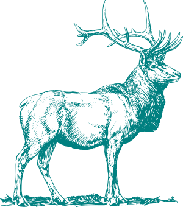
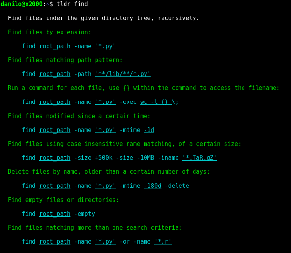

# tealdeer

[![Circle CI][circle-ci-badge]][circle-ci]
[![Crates.io][crates-io-badge]][crates-io]

An implementation of [tldr](https://github.com/tldr-pages/tldr) in Rust:
Simplified, example based and community-driven man pages.

If you pronounce "tldr" in English, it sounds somewhat like "tealdeer". Hence the project name :)

## Goals

High level project goals:

- [x] Download and cache pages
- [x] Don't require a network connection for anything besides updating the cache
- [x] Command line interface similar or equivalent to the [NodeJS client][tldr-node-client]
- [x] Be fast

## Usage

    tldr [options] <command>
    tldr [options]

    Options:

        -h --help           Show this screen
        -v --version        Show version information
        -l --list           List all commands in the cache
        -f --render <file>  Render a specific markdown file
        -o --os <type>      Override the operating system [linux, osx, sunos]
        -u --update         Update the local cache
        -c --clear-cache    Clear the local cache

    Examples:

        $ tldr tar
        $ tldr --list

    To control the cache:

        $ tldr --update
        $ tldr --clear-cache

    To render a local file (for testing):

        $ tldr --render /path/to/file.md

## Installing

Build and install the tool via cargo...

    $ cargo install tealdeer

...or from source (see section "Building" in this README).

If you're an Arch Linux user, you can also install the package from the AUR:

    $ yaourt -S tealdeer-git

### Bash Autocompletion

To get bash autocompletion, simply copy the file `bash_tealdeer` from the
source repository to `/usr/share/bash-completion/completions/`.

## Building

tealdeer requires at least Rust 1.19.

Debug build with logging enabled:

    $ cargo build --features logging

Release build without logging:

    $ cargo build --release

To enable the log output, set the `RUST_LOG` env variable:

    $ export RUST_LOG=tldr=debug

## License

Licensed under either of

 * Apache License, Version 2.0 ([LICENSE-APACHE](LICENSE-APACHE) or
   http://www.apache.org/licenses/LICENSE-2.0)
 * MIT license ([LICENSE-MIT](LICENSE-MIT) or
   http://opensource.org/licenses/MIT) at your option.

### Contribution

Unless you explicitly state otherwise, any contribution intentionally submitted
for inclusion in the work by you, as defined in the Apache-2.0 license, shall
be dual licensed as above, without any additional terms or conditions.

Thanks to @SShrike for coming up with the name "tealdeer"!

[tldr-node-client]: https://github.com/tldr-pages/tldr-node-client

<!-- Badges -->
[circle-ci]: https://circleci.com/gh/dbrgn/tealdeer/tree/master
[circle-ci-badge]: https://circleci.com/gh/dbrgn/tealdeer/tree/master.svg?style=shield
[crates-io]: https://crates.io/crates/tealdeer
[crates-io-badge]: https://img.shields.io/crates/v/tealdeer.svg
