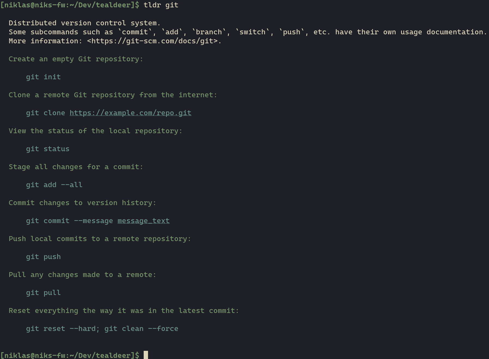

# tealdeer

|Crate|CI (Linux/macOS/Windows)|
|:---:|:---:|
|[![Crates.io][crates-io-badge]][crates-io]|[![GitHub CI][github-actions-badge]][github-actions]|

A very fast implementation of [tldr](https://github.com/tldr-pages/tldr) in
Rust: Simplified, example based and community-driven man pages.

If you pronounce "tldr" in English, it sounds somewhat like "tealdeer". Hence the project name :)

In case you're in a hurry and just want to quickly try tealdeer, you can find static
binaries on the [GitHub releases page](https://github.com/tealdeer-rs/tealdeer/releases/)!

## Docs (Installing, Usage, Configuration)

User documentation is available at <https://docs.tealdeer.org>!

The docs are generated using [mdbook](https://rust-lang.github.io/mdBook/index.html).
They can be edited through the markdown files in the `docs/src/` directory.

## Goals

High level project goals:

- [x] Download and cache pages
- [x] Don't require a network connection for anything besides updating the cache
- [x] Comply with the [tldr client specification][client-spec]
- [x] Advanced highlighting and configuration
- [x] Be fast

A tool like `tldr` should be as frictionless as possible to use and show the
output as fast as possible.

## Development

Creating a debug build with logging enabled:

    $ cargo build --features logging

Release build without logging:

    $ cargo build --release

To enable the log output, set the `RUST_LOG` env variable:

    $ export RUST_LOG=tldr=debug

To run tests:

    $ cargo test

To run lints:

    $ rustup component add clippy
    $ cargo clean && cargo clippy

### AI Policy

Using AI is generally discouraged. However, if it is used as part of a contribution, the contributor MUST:

1. Clearly mark what parts (if any) of a contribution were created with the help of AI tools. This includes issue and pull request comments.
2. Check all output of AI tools before sharing it with others in the tealdeer project.
3. Not post slop, spam, or low quality contributions. This includes pull request descriptions and comments with excessive text and markdown flair.
4. Leave small or easy tasks to new contributors who want to learn without the use of AI. This is to maintain the presence of the `good-first-issue` tag.
5. Be respectful of everyone's time: *maintainers and other contributors will be reviewing your PRs.*

## MSRV (Minimally Supported Rust Version)

When publishing a tealdeer release, the Rust version required to build it
should be stable for at least a month. The current MSRV can always be found in
the `rust-version` field in `Cargo.toml`.

## License

Licensed under either of

 * Apache License, Version 2.0 ([LICENSE-APACHE](LICENSE-APACHE) or
   http://www.apache.org/licenses/LICENSE-2.0)
 * MIT license ([LICENSE-MIT](LICENSE-MIT) or
   http://opensource.org/licenses/MIT) at your option.

### Contribution

Unless you explicitly state otherwise, any contribution intentionally submitted
for inclusion in the work by you, as defined in the Apache-2.0 license, shall
be dual licensed as above, without any additional terms or conditions.

Thanks to @severen for coming up with the name "tealdeer"!

[client-spec]: https://github.com/tldr-pages/tldr/blob/main/CLIENT-SPECIFICATION.md

<!-- Badges -->
[github-actions]: https://github.com/tealdeer-rs/tealdeer/actions?query=branch%3Amain
[github-actions-badge]: https://github.com/tealdeer-rs/tealdeer/actions/workflows/ci.yml/badge.svg?branch=main
[crates-io]: https://crates.io/crates/tealdeer
[crates-io-badge]: https://img.shields.io/crates/v/tealdeer.svg
