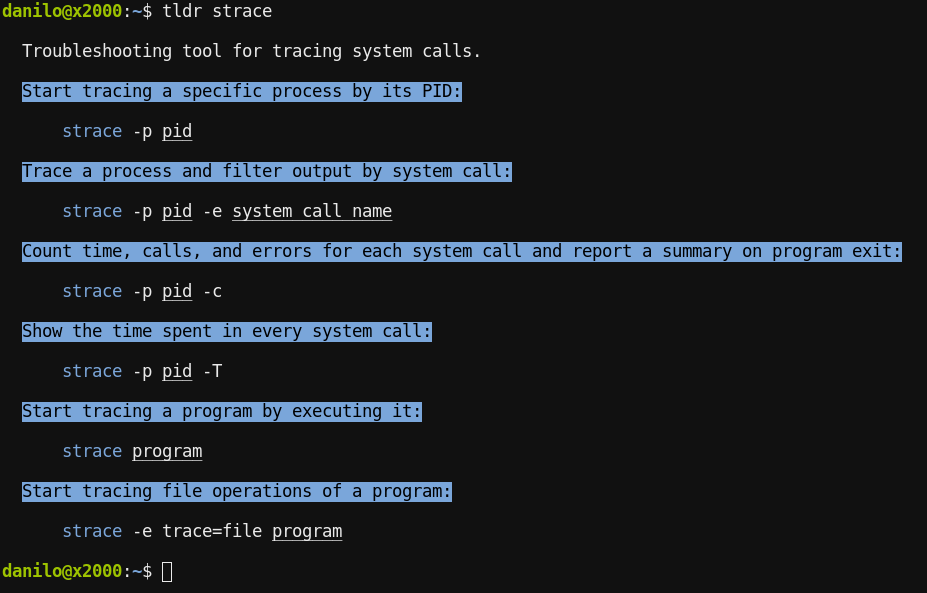

# style

Using the config file, the style (e.g. colors or underlines) can be customized.

## Style Targets

- `description`: The initial description text
- `command_name`: The command name as part of the example code
- `example_text`: The text that describes an example
- `example_code`: The example itself (except the `command_name` and `example_variable`)
- `example_variable`: The variables in the example

## Attributes

- `foreground` (color string, ANSI code, or RGB, see below)
- `background` (color string, ANSI code, or RGB, see below)
- `underline` (`true` or `false`)
- `bold` (`true` or `false`)

Colors can be specified in one of three ways:

- Color string (`black`, `red`, `green`, `yellow`, `blue`, `purple`, `cyan`, `white`):

  Example:

      foreground = "green"

- 256 color ANSI code (*Tealdeer v1.5.0+*)

  Example:

      foreground = { ansi = 4 }

- 24-bit RGB color (*Tealdeer v1.5.0+*)

  Example:

      background = { rgb = { r = 255, g = 255, b = 255 } }
